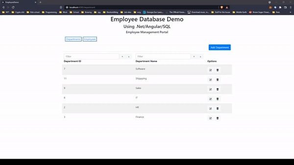

# Employee Database

#### Author: Michael Spikes

A simple employee database built using SQL, ASP.NET, and Angular.

# Table of Contents

- [Employee Database](#Employee Database) - [Author: Michael Spikes](#author-michael-spikes)
- [Table of Contents](#table-of-contents)
  - [Installation](#installation)
  - [Usage](#usage)
  - [Technologies](#technologies)
  - [Questions](#questions)
    - [Picture](#picture)
    - [Email](#email)
  - [Contributors](#contributors)
  - [License](#license)

## Installation

npm i for package.json.
ng serve to start front-end on port 4200.

WebAPI Solution started in Visual Studio

## Usage

## Technologies

SQL
SSMS
ASP.NET
Visual Studio 2019
Angular
Visual Studio Code

## Questions

Please email me with any questions.

### Picture

### Email

michael.spikes85@gmail.com

## Contributors

N/A

## License

N/A
